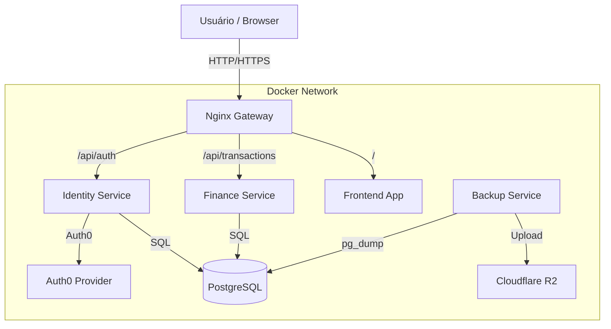

# 💰 Portal Financeiro

O **Portal Financeiro** é uma aplicação moderna de gestão financeira pessoal construída com uma arquitetura de **Microsserviços**. O sistema permite aos usuários gerenciar transações, categorias e visualizar relatórios financeiros detalhados, com autenticação segura via Auth0.

## 🏗️ Arquitetura

O sistema segue uma arquitetura baseada em microsserviços orquestrados por um API Gateway.



## 🚀 Tecnologias

*   **Frontend**: React, Vite, TypeScript, TailwindCSS.
*   **Backend**: Node.js, Express, TypeScript.
*   **Database**: PostgreSQL (Prisma ORM).
*   **Infraestrutura**: Docker, Docker Compose, Nginx (Gateway).
*   **Autenticação**: Auth0.
*   **Backup**: Script automatizado para Cloudflare R2.
*   **CI/CD**: GitHub Actions.

## 📂 Estrutura do Projeto

```
portal-financeiro/
├── apps/
│   ├── backend/
│   │   ├── identity-service/  # Gerencia usuários e autenticação
│   │   └── finance-service/   # Gerencia transações e categorias
│   ├── frontend/              # Aplicação React
│   ├── gateway/               # Configuração do Nginx
│   └── backup/                # Serviço de backup automático
├── .github/workflows/         # Pipelines de CI/CD
├── docker-compose.yml         # Orquestração para Desenvolvimento
└── docker-compose.prod.yml    # Orquestração para Produção
```

## 🛠️ Como Rodar Localmente

### Pré-requisitos
*   Docker e Docker Compose instalados.
*   Node.js (opcional, para rodar scripts locais).

### Passo 1: Configuração de Ambiente
Crie os arquivos `.env.local` dentro de cada serviço em `apps/backend/` com as credenciais necessárias (Auth0, Banco de Dados, etc).

### Passo 2: Iniciar a Aplicação
Na raiz do projeto, execute:

```bash
docker compose up --build
```

O sistema estará disponível em:
*   **Frontend**: http://localhost:8080
*   **API Gateway**: http://localhost:8080/api

> **Nota**: O ambiente de desenvolvimento usa `docker-compose.yml`, que monta volumes locais e habilita *hot-reload* para o código.

## 📦 Deploy e Produção

Para rodar em produção, utilize o arquivo `docker-compose.prod.yml`. Este arquivo utiliza imagens otimizadas do Docker Hub e inclui serviços adicionais como **Cloudflared** (para túnel seguro) e **Watchtower** (para atualização automática).

```bash
docker compose -f docker-compose.prod.yml up -d
```

### Variáveis de Ambiente de Produção
Certifique-se de configurar as variáveis para o backup no R2:
*   `R2_ACCESS_KEY_ID`
*   `R2_SECRET_ACCESS_KEY`
*   `R2_ENDPOINT_URL`

## 🛡️ Backup Automático

O sistema possui um serviço dedicado (`apps/backup`) que realiza backups diários do banco de dados PostgreSQL e os envia para um bucket no **Cloudflare R2**.

*   **Frequência**: A cada 24 horas.
*   **Formato**: Arquivo SQL comprimido (`.sql.gz`).
*   **Restauração**:
    1.  Baixe o arquivo do R2.
    2.  Copie para o container: `docker cp backup.sql ID_DO_CONTAINER:/tmp/`
    3.  Importe: `docker compose exec -T db psql -U user -d finance_db -f /tmp/backup.sql`

## 🔄 CI/CD (GitHub Actions)

Cada serviço possui seu próprio pipeline de deploy:
*   `identity-service-publish.yml`: Dispara em mudanças em `apps/backend/identity-service`.
*   `finance-service-publish.yml`: Dispara em mudanças em `apps/backend/finance-service`.
*   `web-publish.yml`: Dispara em mudanças em `apps/frontend`.

As imagens são construídas e enviadas automaticamente para o Docker Hub.
