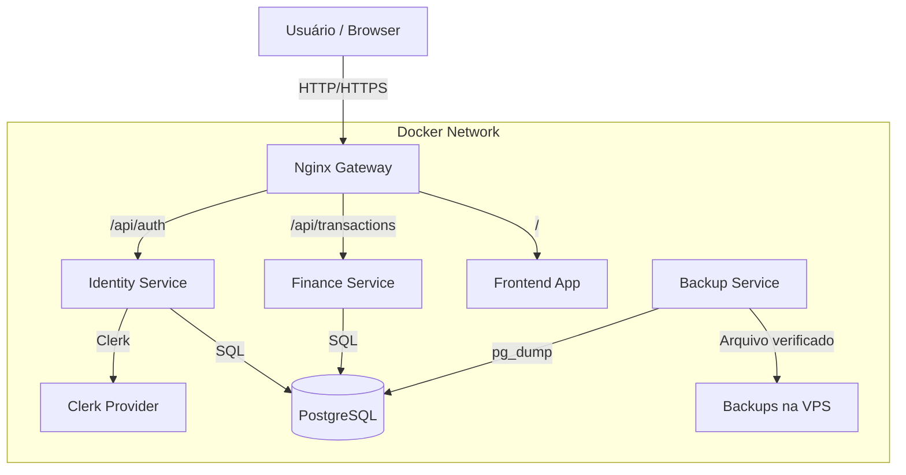

# 💰 Portal Financeiro

O **Portal Financeiro** é uma aplicação de gestão financeira pessoal com frontend React, dois serviços Node.js e PostgreSQL. O sistema permite gerenciar transações, categorias, membros e regras de orçamento, com autenticação via Clerk.

## 🏗️ Arquitetura

O sistema segue uma arquitetura baseada em microsserviços orquestrados por um API Gateway.


```mermaid
graph TD
    User[Usuário / Browser] -->|HTTP/HTTPS| Gateway[Nginx Gateway]
    
    subgraph "Docker Network"
        Gateway -->|/api/auth| Identity[Identity Service]
        Gateway -->|/api/transactions| Finance[Finance Service]
        Gateway -->|/| Frontend[Frontend App]
        
        Identity -->|Clerk| Clerk[Clerk Provider]
        Identity -->|SQL| DB[(PostgreSQL)]
        Finance -->|SQL| DB
        
        Backup[Backup Service] -->|pg_dump| DB
        Backup -->|Arquivo verificado| Storage[Backups na VPS]
    end
```

## 🚀 Tecnologias

*   **Frontend**: React, Vite, TypeScript, CSS e Chart.js.
*   **Backend**: Node.js, Express, TypeScript.
*   **Database**: PostgreSQL (Prisma ORM).
*   **Infraestrutura**: Docker, Docker Compose, Nginx (Gateway).
*   **Autenticação**: Clerk.
*   **Backup**: PostgreSQL custom dump antes de cada release e diariamente.
*   **CI/CD**: GitHub Actions.

## 📂 Estrutura do Projeto

```
portal-financeiro/
├── apps/
│   ├── backend/
│   │   ├── identity-service/  # Gerencia usuários e autenticação
│   │   └── finance-service/   # Gerencia transações e categorias
│   ├── frontend/              # Aplicação React
│   ├── gateway/               # Configuração do Nginx
│   └── backup/                # Serviço de backup automático
├── .github/workflows/         # Pipelines de CI/CD
├── docker-compose.yml         # Orquestração para Desenvolvimento
└── deploy/compose.slot.yml    # Slots blue/green com imagens por digest
```

## 🛠️ Como Rodar Localmente

### Pré-requisitos
*   Docker e Docker Compose instalados.
*   Node.js (opcional, para rodar scripts locais).

### Passo 1: Configuração de Ambiente
Configure os arquivos `.env.local` de cada serviço com as credenciais Clerk da mesma instância. No frontend, configure `VITE_CLERK_PUBLISHABLE_KEY` e `VITE_API_URL=/api`.

As URLs de banco dos serviços precisam apontar para `db:5432/finance_db`, com `?schema=identity` no identity-service e `?schema=finance` no finance-service. Preserve a separação dos schemas: o serviço financeiro consulta `identity."UserIdentity"`.

As chaves secretas devem ficar apenas nos serviços backend. Não publique credenciais nos commits.

### Passo 2: Iniciar a Aplicação
Na raiz do projeto, execute:

```bash
docker compose up -d --build
```

O sistema estará disponível em:
*   **Frontend**: http://localhost:8080
*   **API Gateway**: http://localhost:8080/api

As portas publicadas estão restritas a `127.0.0.1`. Os serviços de identidade e finanças têm verificações HTTP em `http://localhost:3001/health` e `http://localhost:3002/health`. Essas rotas verificam também a conexão com o banco.

O Compose aguarda o PostgreSQL ficar disponível e sincroniza os schemas com `prisma db push` sem aceitar perda de dados automaticamente. Se uma alteração exigir remoção de dados, a inicialização será interrompida para revisão.

Para consultar o estado, acompanhar logs e parar sem apagar o volume do banco:

```bash
docker compose ps
docker compose logs -f identity-service finance-service frontend gateway
docker compose stop
```

O Portainer é opcional: `docker compose --profile admin up -d portainer`.

Para executar apenas o Vite fora do Docker, mantenha banco, APIs e gateway ativos, acesse `apps/frontend` e execute `npm run dev`. O proxy usa `http://localhost:8080` por padrão; no container usa `VITE_API_PROXY_TARGET=http://gateway`.

Veja a [análise técnica de 19/09/2026](docs/analise-tecnica-2026-09-19.md) para os resultados de build, testes e problemas encontrados.

> **Nota**: O ambiente de desenvolvimento usa `docker-compose.yml`, que monta volumes locais e habilita *hot-reload* para o código.

## 📦 Deploy e Produção

Produção usa GitHub Actions → GitHub Container Registry → VPS com Docker Compose. Cada tag de versão aprovada pelos testes gera quatro imagens, publicadas e implantadas pelo digest SHA-256. O Caddy existente na VPS fornece HTTPS para `portalfinanceiro.net`.

O fluxo preparado para 1.8.0 usa blue/green: prepara e testa a candidata antes de trocar o tráfego no Caddy, preservando a versão ativa em falhas de preparação. O banco permanece independente; novas migrações exigem uma operação compatível e revisada antes da publicação. Consulte [o guia blue/green](docs/blue-green.md) e [a operação da VPS](docs/VPS.md). O antigo `docker-compose.prod.yml` não é usado pelo fluxo atual.

Pull requests e alterações em `main` executam lint, testes, builds, auditoria de dependências e migrações em PostgreSQL descartável. Apenas tags `vX.Y.Z`, correspondentes ao arquivo `VERSION` e contidas em `main`, publicam em produção.
