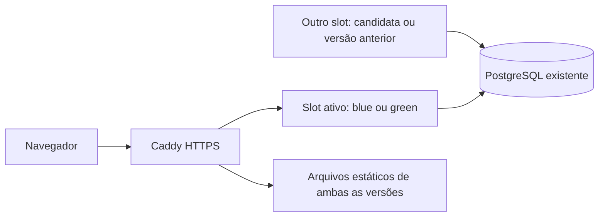

# Publicação blue/green

A partir do fluxo preparado para 1.8.0, a versão atual continua atendendo enquanto a próxima inicia em outro conjunto de containers. O Caddy recebe uma recarga de configuração somente depois das verificações. Não há `compose down`, recriação do banco ou parada da aplicação ativa durante essa preparação.

O código está preparado para a VPS atual. A partir de 1.8.1, a tag apenas prepara imagens. A ativação ocorre somente ao executar manualmente `Deploy production` em `main`, informando a tag já preparada; commit, push e tag não alteram o tráfego de produção.

## Componentes



- `compose.slot.yml` cria gateway, frontend e duas APIs por slot, com limites de memória e logs. Cada slot tem sua própria rede de backend; ambos acessam o mesmo PostgreSQL pelo alias `db`.
- Os gateways possuem aliases distintos na rede externa do Caddy. Não publicam portas no host.
- O banco e seu volume continuam pertencendo ao projeto original `portal-financeiro`. Os scripts de aplicação não os recriam. O backup diário continua usando esse banco.
- Apenas o snippet `/data/sites/portalfinanceiro.caddy` é alterado. Os demais sites e o container Caddy não são reiniciados.
- Recorrências e push consultam `/run/deployment/active-slot`; a candidata não inicia novos lotes de tarefas agendadas. Um lote já iniciado pode terminar após a troca; transações, chaves únicas e leases continuam sendo necessários para concorrência.

## Sequência e falhas

1. O deploy obtém o lock compartilhado com backup/rollback, recupera uma transição interrompida e confere a versão ativa.
2. Baixa as imagens por digest e verifica acesso às chaves de push com o usuário real da imagem. Nenhum segredo é exibido.
3. Confere o contrato de compartilhamento e o histórico de migrações dos dois schemas, incluindo checksums. Uma divergência encerra a publicação antes da troca de tráfego.
4. Faz e verifica o backup local e a cópia criptografada no R2.
5. Copia os arquivos de `/assets` das imagens atual e candidata para o volume persistente do Caddy. Inicia a candidata e exige healthchecks, revisão correta de frontend/APIs e bloqueio de rotas sem autenticação.
6. Registra a configuração anterior e os ponteiros em disco. Valida e recarrega o Caddy, sem parar o processo. Confere a versão pelo HTTPS público três vezes antes de confirmar a promoção e ativar seus workers.
7. Mantém o conjunto anterior disponível para rollback. Antes de reutilizar um slot, respeita pelo menos 60 segundos desde a última promoção.

| Falha | Comportamento |
| --- | --- |
| Pull, segredos, schema, backup ou inicialização da candidata | A versão ativa continua atendendo; não há troca do proxy. |
| Configuração inválida do Caddy | A configuração em execução permanece ativa; o script restaura o arquivo anterior. |
| Verificação pública falha após a troca | O script tenta restaurar automaticamente a rota e os ponteiros anteriores, mantendo os dois conjuntos de containers. |
| Interrupção do processo | Sinais tratáveis acionam recuperação. Após `SIGKILL` ou perda de energia, o registro em disco é recuperado na próxima execução. |
| Recuperação falha | O deploy falha, preserva os containers e mantém o registro para diagnóstico; não restaura o banco nem desliga o gateway. |

Uma falha real da candidata **depois** de começar a receber tráfego pode afetar requisições até sua detecção e recuperação. Os testes não constituem garantia de disponibilidade absoluta. Falhas posteriores à conclusão do deploy continuam dependendo do monitoramento e da operação.

O teste externo final do GitHub continua sendo uma confirmação de outra origem. Se somente ele falhar após a publicação já confirmada pela VPS, exige diagnóstico; uma indisponibilidade de rede do runner não reverte automaticamente uma aplicação saudável.

## Banco: expandir, migrar, remover

O deploy de aplicação não executa mais `prisma migrate deploy`. Uma tag com novas migrações será bloqueada até uma operação de banco separada e revisada. Isso é intencional: blue/green não protege contra SQL que torna a versão ativa incompatível ou mantém locks longos.

Para uma mudança futura:

1. Preparar uma expansão compatível com a versão ativa: colunas opcionais/novas tabelas, índices com estratégia adequada e limites de lock. Testar a aplicação antiga sobre o schema expandido em banco descartável.
2. Verificar backup externo e restauração. Executar somente as migrações revisadas, sob o mesmo `/srv/portal-financeiro/deploy.lock`, com a imagem fixada da release. A operação de migração precisa de um plano próprio; não existe um bypass automático nesta publicação.
3. Publicar a aplicação com o histórico já aplicado. Se necessário, migrar dados em lotes com retomada e compatibilidade de leitura/escrita entre versões.
4. Remover estruturas antigas em outra etapa, somente após encerrar a janela de rollback e o uso pelas versões anteriores. Mudanças no contrato de compartilhamento exigem uma ponte de compatibilidade específica; não basta aumentar o número do contrato.

Não executar `db push`, restaurar dumps sobre produção ou editar checksums para fazer o deploy passar. Rollback de aplicação não desfaz dados gravados nem migrações.

## Primeira ativação

A implementação parte da instalação atual, com `/srv/portal-financeiro/current-release`, PostgreSQL saudável, backups R2, snippet importado pelo Caddy e contrato financeiro 3. Não é um instalador de banco vazio.

A primeira publicação passa de `legacy` para `blue`; mantém os containers originais para retorno. Os workers originais ainda não conhecem o marcador de slot e podem continuar trabalhando nessa janela, protegidos pelos mecanismos existentes de concorrência. Na segunda promoção bem-sucedida entre slots gerenciados, o script para apenas os quatro containers de aplicação originais. O banco original permanece ligado.

Reservar capacidade para duas versões; durante a segunda publicação, os containers legados ainda existem até a confirmação. Verificar memória, conexões de banco e disco antes de ampliar a aplicação.

## Inspeção e rollback

Executar como o usuário de deploy. Depois da primeira ativação bem-sucedida:

```bash
ROOT=/srv/portal-financeiro
release=$(cat "$ROOT/current-release")
slot=$(cat "$ROOT/runtime/active-slot")
DEPLOYMENT_SLOT="$slot" docker compose -p "portal-financeiro-$slot" \
  --env-file "$ROOT/config.env" --env-file "$release/images.env" \
  -f "$release/compose.slot.yml" ps
bash "$release/rollback.sh"
```

O rollback verifica a revisão do conjunto anterior e troca o Caddy, sem recriar containers. Fica disponível enquanto esse conjunto for preservado. Ao reutilizar o slot numa nova tentativa de deploy, a versão anterior pode ser substituída mesmo que a tentativa falhe; nesse caso, a versão ativa segue disponível, mas aquele rollback antigo deixa de estar garantido. Não remover imagens ou containers de rollback durante sua janela de retenção.

Se a primeira ativação falhou, `current-release` pode apontar para uma release legada. Para recuperar uma transição, usar o **novo** script `rollback.sh` na pasta da release 1.8.0 enviada pelo workflow, nunca o rollback antigo. Ele recupera primeiro o registro pendente; se não houver um `previous-release` utilizável, termina sem uma segunda troca.

Estado persistente:

- `current-release`, `previous-release`: pastas de release.
- `runtime/active-slot`: workers autorizados (`legacy`, `blue`, `green`), legível pelas APIs; diretório montado somente para leitura.
- `deployment/previous-slot`, `deployment/blue-release`, `deployment/green-release`, `deployment/promoted-at`: metadados operacionais privados.
- `deployment/transition`: configuração e metadados para recuperação. Não apagar manualmente durante uma transição.

O cache `/data/portal-financeiro-assets` preserva os arquivos com hash das versões anteriores para abas abertas e rollback, inclusive o retorno inicial ao frontend legado. Nunca sobrescreve arquivos existentes. Seu tamanho cresce por release; uma política futura de limpeza precisa preservar as versões retidas e definir a janela de suporte a abas antigas.

## Validação e limites

Em 26/09/2026, o teste isolado com Docker, Nginx e Caddy passou por candidata parada, configuração inválida, falha na validação pública, recuperação do registro, promoção, rollback e contrato incompatível: **329 requisições, todas HTTP 200**. Arquivos estáticos de ambas as versões permaneceram acessíveis. A falha pública é injetada no verificador; esse resultado não simula todas as falhas possíveis de uma API real.

Os verificadores de schema e saúde também passaram com as imagens atuais e consultas somente de leitura em produção, sem aplicar migrações nem trocar tráfego. Os testes de regressão de schema/probes e de seleção de workers acompanham o código. O CI executa o laboratório em infraestrutura descartável.

Uma VPS, um banco e um Caddy ainda são pontos únicos de falha. Alta disponibilidade diante de perda do servidor exige outra máquina/zona, balanceamento externo, redundância de dados e testes de failover. Blue/green reduz o risco das publicações; não substitui essa infraestrutura, testes de carga ou homologação dos fluxos financeiros.

Referências: [recarga graciosa do Caddy](https://caddyserver.com/docs/command-line#caddy-reload) e [migrações com expansão e contração no Prisma](https://www.prisma.io/docs/guides/database/data-migration).
